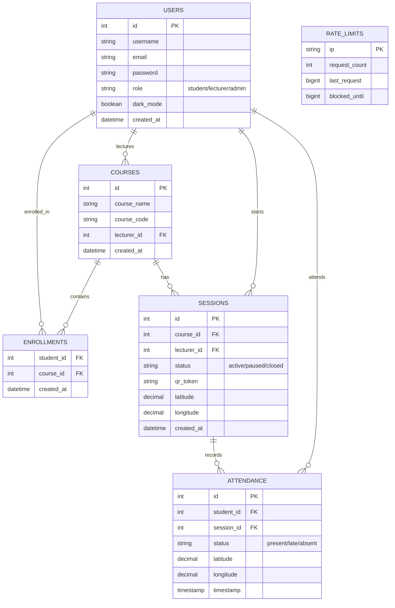
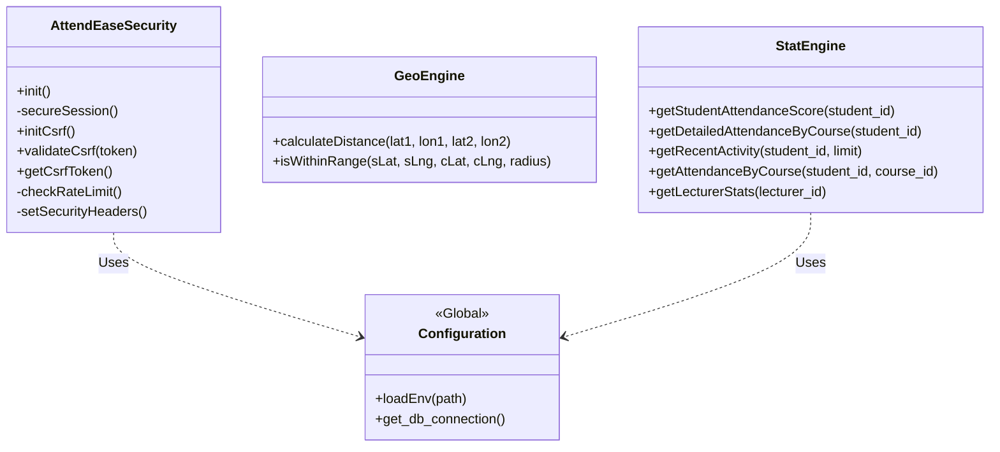
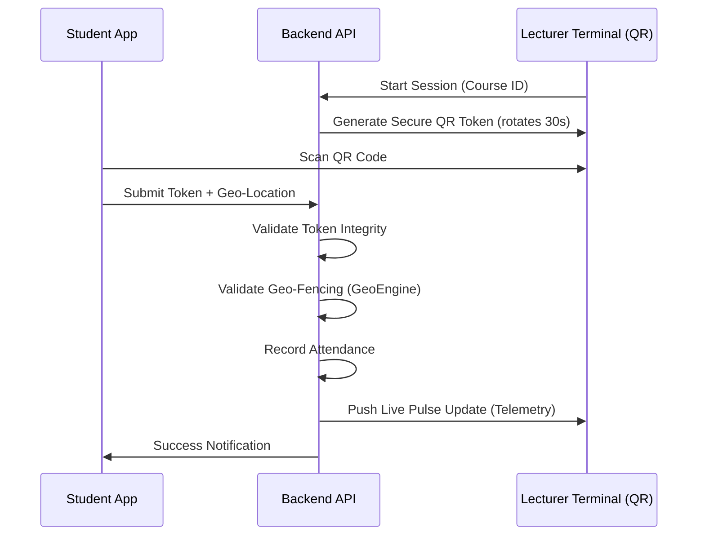

# 🚀 AttendEase Pro: The Future of Attendance Intelligence

[](https://web.dev/progressive-web-apps/)
[](https://owasp.org/)
[](https://web.dev/fast/)
[](https://github.com/ghdcodes/attend-ease)

AttendEase Pro is a high-fidelity, biometric-style attendance ecosystem designed for enterprise-grade academic environments. It leverages the "Aura" design system to provide a seamless, secure, and lightning-fast experience across all devices, from mobile student clients to massive classroom projection terminals.

---

## 💎 Design Philosophy: The "Aura" System

AttendEase Pro is built on a proprietary design language we call **"Aura"**. It prioritizes depth, cinema-grade motion, and visual clarity.

- **Glassmorphism 2.0**: Utilizing `-webkit-backdrop-filter` for translucent layers that feel premium and tactile.
- **Cinematic Transitions**: Every interaction is governed by custom `cubic-bezier(0.4, 0, 0.2, 1)` timing functions for a fluid, organic feel.
- **Midnight Spectrum**: A curated palette centered on deep slate and electric blue, optimized for high-contrast visibility in darkened lecture halls.
- **Bento-Grid Architecture**: Information is organized into high-density, interactive cells that adapt dynamically to any screen resolution.

---

## 🛠️ Feature Catalog: Comprehensive Breakdown

### 1. 🎓 Onboarding & Authentication
- **High-Impact Intro**: A 3-stage immersive onboarding journey with entrance animations.
- **Face ID Simulation**: A premium-styled biometric scanning animation during login.
- **Secure Vault**: Industry-standard Argon2ID password hashing and CSRF-protected session management.

### 2. 👨‍🏫 Faculty Hub: Master Command Terminal
- **Dual-Viewport Architecture**:
    - **Mobile View**: Optimized for lecturers walking around the class, featuring a live attendee pulse.
    - **Projection Mode (Desktop)**: A massive, cinematic interface intended for overhead projectors.
- **Session Control Center**: One-tap **Pause/Resume** and **Clear** controls available directly from the Dashboard and the QR Hub.
- **Real-time Telemetry**: Instant updates on student check-ins with visual "ping" animations.

### 3. 📊 Intelligence Command (Analytics)
- **Risk Radar**: Automatically identifies students whose attendance falls below the 75% threshold using predictive logic.
- **Attendance Trendlines**: Integrated **Chart.js** visualizations showing patterns over time.

### 4. 🛡️ High-Integrity Security Suite
- **QR Rotation & Backend Verification**: QR tokens rotate every 30 seconds. The backend strictly enforces session status, refusing to generate tokens for paused sessions.
- **Geo-Fencing & Anti-Proxy**: Integrated location validation ensures students are physically present in the classroom.
- **Environment Protection**: Sensitive credentials managed via `.env` (ignored by version control).

### 5. 💎 Resilient "Aura" Design
- **Inline SVG Architecture**: Critical controls (Pause, Resume, Clear) use high-reliability inline SVGs, ensuring 100% visibility even if external icon libraries fail.
- **Glassmorphism 2.0**: Utilizing `-webkit-backdrop-filter` for translucent layers that feel premium and tactile.

---

## 📂 Core Directory Structure

```text
├── assets/                     # Aura Design Tokens & JS Logic
├── includes/
│   ├── config.php              # Environment & DB Loader
│   ├── security.php            # CSRF, Rate Limiting & Auth Guard
│   ├── GeoEngine.php           # Geo-Spatial Logic
│   ├── stat_engine.php         # Analytics & Metrics Logic
│   ├── get_qr_token.php        # Secure Token Engine (Status Aware)
│   └── process_attendance.php   # Attendance Logic & Geo-Verification
├── lecturer/                   # Faculty Entry Hub & Projection
├── student/                    # Student Progress & Verification
├── .env                        # Local Environment Variables (Secret)
├── .gitignore                  # Repository Ignore Rules
└── manifest.json               # PWA App Identity
```

---

## 📐 System Architecture & Data Models

### 1. Entity Relationship Diagram (ERD)
The database architecture is designed for high relational integrity and optimized for analytical queries.



### 2. Logic Class Diagram
AttendEase Pro utilizes a modular service architecture to handle security, geo-fencing, and intelligence metrics.



### 3. High-Level System Workflow
A visualization of the secure attendance loop.



---


## ⚙️ Engineering & Deployment

### Server Requirements
- **PHP**: 8.1+ (PDO and JSON extensions required).
- **Web Server**: Apache 2.4+ (mod_rewrite enabled).
- **Environment**: `.env` file support enabled.

### Quick Start
1. **Repository Sync**: Clone to your local environment.
2. **Automatic Installation (Recommended)**: 
   - Navigate to `/setup.php` in your browser.
   - **Dev-Terminal Interface**: You will be greeted by a sleek, modern developer-focused mock terminal UI.
   - **Intelligent Configuration**: Enter your MySQL parameters. The script will dynamically read the `database.sql` schema and adapt it to your inputs.
   - **Automated Execution**: It will automatically run the schema creation, table setup, and populate the system with demo users and courses.
   - **Environment Automation**: Finally, it generates and saves your secure `.env` file with the correct credentials and cryptographic keys, all while displaying a simulated CLI deployment log.
3. **Manual Setup (Alternative)**: 
   - Create and configure a `.env` file manually.
   - Import the SQL schema from `database.sql` via your preferred SQL client (e.g., phpMyAdmin).
4. **Endpoint Verification**: Open the root `/index.php` or navigate to `/lecturer/dashboard`.

### 🔑 Demo Accounts (Default Passwords: `password123`)

For testing and demonstration, use the following pre-configured credentials:

| Role | Username | Full Name | Description |
| :--- | :--- | :--- | :--- |
| **System Admin** | `admin` | System Administrator | Full environment access (if configured). |
| **Lecturer (Faculty)** | `dr_okafor` | Dr. Chima Okafor | Primary lecturer, runs CSC401 & CSC402. |
| **Lecturer (Faculty)** | `dr_sarah` | Dr. Sarah Ahmed | Runs CSC404 & CSC405. |
| **Student (Default)** | `student1` | Alice Smith | Student profile for scanning QR codes. |
| **Student (Default)** | `student2` | Bob Johnson | Additional student profile. |
| **Student (Dynamic)** | `oluwaseun1` | Oluwaseun Adeyemi | Dynamic student generated by the seeding script (`seed_student_17.php`). |
| **Parent** | `mr_smith` | Mr. Smith | Parent portal demo account linked to Alice Smith. |

---

## 🏆 Performance Benchmarks
- **Cold Boot Time**: < 1.2s on standard mobile browsers.
- **QR Verification Latency**: < 120ms (client-side processing).
- **Telemetry Sync**: Webhook-based updates every 5 seconds.

---

## 📄 License & Attribution
Distributed under the **MIT License**. 

Design and Engineering by **GHDCODES**. Special thanks to the **AttendEase Pro** faculty advisors for defining the future of classroom management.

---
*Elevate your institution with AttendEase Pro.*
